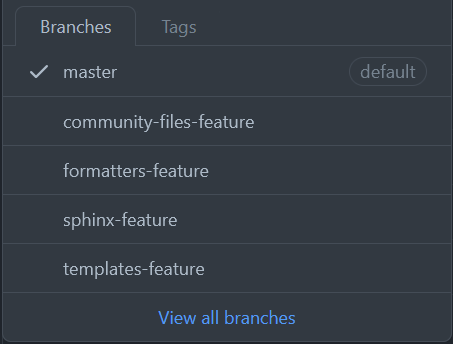

# Implementation Strategy

## Git Subtrees
The crux of symbiflow-common-config is git subtrees. This is a tool built right into git, allowing you to nest one repository inside of another as a dependency. Subtrees offer numerous advantages over other commonly used dependency tools like git submodules (easy setup and maintenance, no new commands that developers must learn in order to work with the dependencies, etc.)

In our case, symbiflow-common-config is the repository that will be merged into all other SymbiFlow projects as a git subtree.

To learn more about git subtrees and how they work, see [this page](https://www.atlassian.com/git/tutorials/git-subtree).

## How files will be organized in symbiflow-common-config
While we already have a draft of many of the files we hope to include in symbiflow-common-config, we will not be implementing them all at once. To accommodate this, we will push groups of similar files to branches other than “main”, granting the option to merge in any of these feature sets to test as we see fit.

 

## Testing strategy
As said earlier, we are using a wide approach, rather than deep. That is to say, we will implement one small feature organization-wide before moving on to other features.

The first feature we will test/implement is the default community health files (`CONTRIBUTING.md`, `CODE_OF_CONDUCT.md`, etc.). Adding these files would not significantly alter/change the functionality of repositories, but they are still important and missing in many SymbiFlow projects.

In the testing phase we will add the feature to a small subset of repositories, to ensure stability and have a chance to catch any unforeseen problems. The first repository we plan to add files to as a test is [`pjxray-bram-patch`](https://github.com/SymbiFlow/prjxray-bram-patch), as it does not contain many of the features common-config will implement. The other testing repositories are not yet decided, but will contain at least one that already includes common-config features, giving us the opportunity to ensure our implementation resolves these types of conflicts okay.

This process will then be repeated with all other feature sets.

Order of feature implementation: (organized from least to most complex)
1. Community Health Files
2. Issue and Pull Request Templates
3. EditorConfig and Autoformatters
4. Sphinx and Readthedocs setup

## Implementation
The actual process of adding symbiflow-common-config as a subtree relies on a few simple scripts that in essence do the following:
1. Fork and clone a SymbiFlow-owned repository
2. On a new branch, add symbiflow-common-config as a subtree (`git subtree add` . . .)
3. Move all files to their correct location making new directories as needed *
4. Submit changes as a PR to the repository

\* Many symbiflow-common-config files need to be in a certain location in order to function (Issue templates need to be in `/.github`, `.editorconfig` file needs to be in root, etc.). Our current setup moves files from `third_party/common-config` to their correct location without breaking functionality of other commands like `git subtree pull`

### Important Notes
If one of these files already exists in the target repository, the script will make a copy of the original file before overwriting. Most of the files we add will be compatible with all currently active SymbiFlow repositories, so overwriting will not break functionality anyways.

Files will be placed in a way that matches their directory structure in the original symbiflow-common-config repo. Ex: If a `conf.py` file location is as follows `symbiflow-common-config/docs/conf.py` , it will be moved to `target-repo/docs/conf.py` . This would allow new files to be added easily with no change to the scripts required.

This script could be used on a single repository for testing, or organization-wide when we are ready to roll out a new feature.

A similar script would be used to update common-config files in repositories but using `git subtree pull` instead of `git subtree add`

## Further development and updates to symbiflow-common-config
Any changes to common-config files that are not project-specific should be submitted via pull request to the original symbiflow-common-config repository.

If these changes are reviewed and accepted, other repositories that have already merged symbiflow-common-config as a subtree will be able to pull in new changes by running a `update_common_config.sh` shell wrapper from inside the parent repository. 

It would be possible to update all SymbiFlow repositories at once with the new common-config features, but as some repositories might require extra effort and manual intervention to conform to the standards imposed by common-config, we believe it would be best to pull in updates to the common-config subtrees on a per-repository basis.

## How would this impact developers
Thanks to the beauty and simplicity of git subtrees, there is no need for users of SymbiFlow repositories to run any additional commands to take advantage of common-config’s features. `git clone` will work as normal, and when a user runs the script to update common-config files, everyone else will be able to run `git pull` to get the new updates, as usual.

## Issues
- Should SymbiFlow’s forked repositories include all/any of common-config’s features? Since these repositories come from other organizations with pre-existing setups that differ from ours, should they be left alone?
  - We should probably not add common-config to repositories that SymbiFlow has forked, since often it is the goal to be able to push our additions back upstream.
- Should we allow individual repositories to customize files from common-config according to their liking? Ex: Adding a new sphinx extension, adding a few lines to `CONTRIBUTING.md`, etc.
  - It would be nice to have a mechanism like: "common-config checks if there is any repo-specific counterpart of a given file of interest and includes it"
- Do we want to add CI checking to verify that all common-config files are still in place and have not been moved/tampered with?

